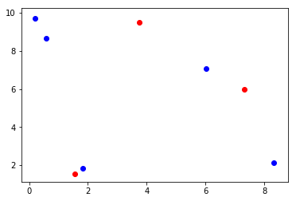

# Centroid distances calculation

First, import the necessary libraries:
- 1 - ```Numpy``` to create the points
- 2 - ```Matplotlib``` to make the plots
- 3 - ```Scipy``` to calculate the Euclidean distances


```python
import numpy as np
import matplotlib.pyplot as plt
from scipy.spatial import distance as dist
```

#### Create the points
*Use random seed for reproducibility*  
```objectCentroid```: alredy tracked centroids  
```centroids```: centroids detected in the current frame


```python
np.random.seed(42)
objectCentroids = np.random.uniform(size=(3,2)) * 10
centroids = np.random.uniform(size=(5,2)) * 10
        
plt.figure()
plt.scatter(*zip(*objectCentroids), c='r')
plt.scatter(*zip(*centroids), c='b')
plt.show()
```





#### Calculate distances
scipy distance function computes the distances between each pair of points on each vectors


```python
D = dist.cdist(objectCentroids, centroids)
D
```


    array([[3.27553692, 3.31980708, 3.54475744, 8.68834075, 7.91140603],
           [7.25066088, 1.70589385, 8.02453102, 3.99164878, 6.89290769],
           [7.16902511, 7.09155104, 8.25106402, 6.78766632, 0.376467  ]])


#### Understand the points
Let's take a look at the numpy arrays created, and give number to the points to understand the distances being computed above:


```python
print('Red points')
print(objectCentroids)
print('Blue points')
print(centroids)
```

    Red points
    [[3.74540119 9.50714306]
     [7.31993942 5.98658484]
     [1.5601864  1.5599452 ]]
    Blue points
    [[0.58083612 8.66176146]
     [6.01115012 7.08072578]
     [0.20584494 9.69909852]
     [8.32442641 2.12339111]
     [1.81824967 1.8340451 ]]


So we could now visualize which points is each, and understand what each value of the Matrix D means.  
D is a ```3x5``` matrix. Each row represent each of the red points and each column represent each of the blue points.  
Therefore, each cell correpond to the distance between that pair of red-blue points


#### Assigning points
We are trying to answer the question:  
**Which blue point might correspond to a red point in a previous frame?**  

Therefore, we want to first match the two closest pair of points. Then, the next ones and so on.  
```D.min(axis=1)``` gives as the minimal value of D at each row


```python
D.min(axis=1)
```


    array([3.27553692, 1.70589385, 0.376467  ])


We are interested however in the indexes at which each of these values is located in the matrix.  
We use ```argsort``` to get those indexes sorted by lower to higher


```python
rows = D.min(axis=1).argsort()
rows
```


    array([2, 1, 0])


As we saw in the picture above, the third red point (index 2) is the closest one to any of the blue points. Then 2 and finally 1.  
Now, we want to return the column indexes that matches the found points. This time we use the ```argmin``` method and sort by the rows


```python
cols = D.argmin(axis=1)[rows]
cols
```


    array([4, 1, 0])


```python
print('Points')
print(list(zip(rows, cols)))
```

    Points
    [(2, 4), (1, 1), (0, 0)]


If we look at the pairs then ```(2,4)```, ```(1,1)```, ```(0,0)``` in D matrix (below) we can see they are the three min points sorted:  

